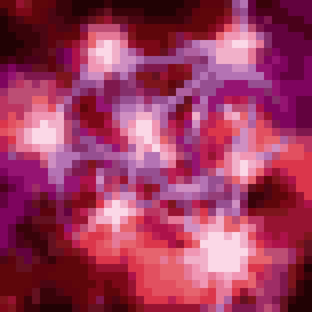
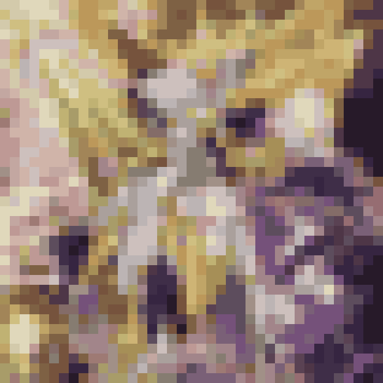
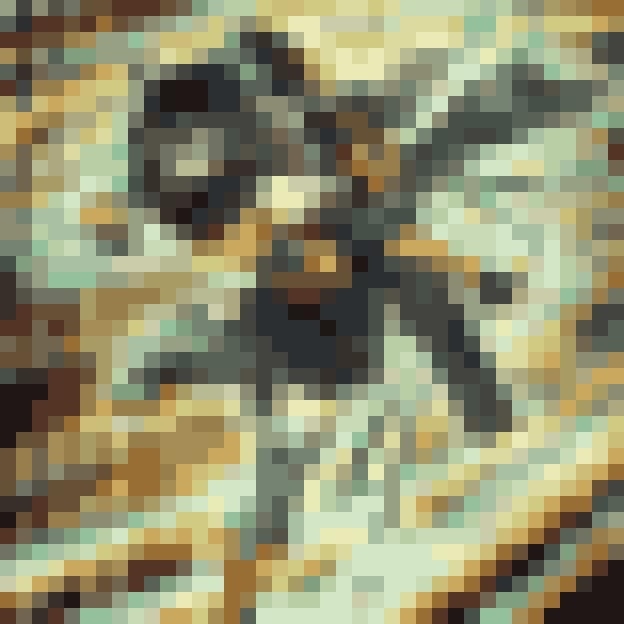
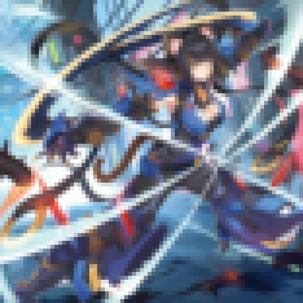
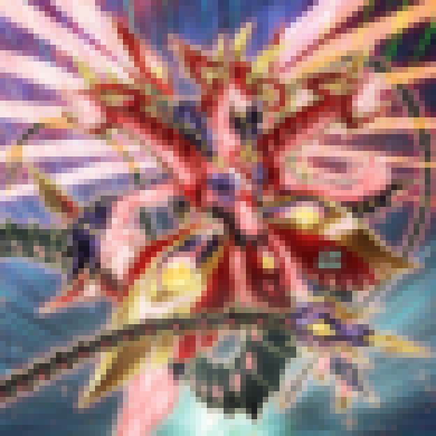
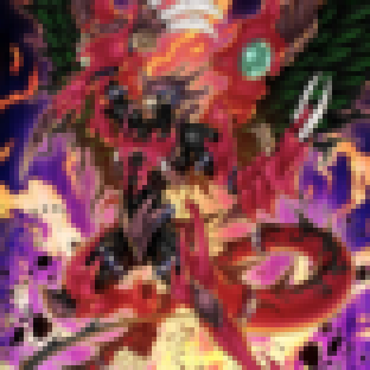

# Pixel Art of YuGiOh Cards

将游戏王卡图转化为像素图(近期流行，AIGC 了一个)

## 效果展示

参数

```json
"pixel_size": 16,"quantize": true,"colors": 32
```

<center class="half">



</center>

```json
"pixel_size": 8,"quantize": false,"colors": 32
```

<center class="half">



</center>
## 结构

-   `cfg`:配置
    -   `last_config.json`:`generate.py`脚本的配置参数
-   `target`:像素图默认输出目录
-   `tmp`:卡图默认输出目录，也是像素图默认输入目录
-   `generate.py`:像素图生成
-   `getImage.sh`:卡图获取
-   `start.sh`:一键脚本

## 使用

### 安装依赖

```bash
pip install -r requirements.txt
```

### 获取卡图

```bash
./getImage.sh
```

### 生成像素图

```bash
python generate.py
```

### 一键脚本

```bash
./start.sh
```

## 参数

### `generate.py`

```
python generate.py [--input-dir TMP] [--output-dir TARGET] [--pixel-size N] [--quantize] [--colors C] [--yes]
```

### `start.sh`

```
❯ ./start.sh --help
Usage: start.sh [--no-venv] [--venv-dir DIR] [--skip-install] [--help] -- [generate.py args]

Options:
  --no-venv        Don't create/activate virtualenv, use system Python
  --venv-dir DIR   Virtualenv directory (default: .venv)
  --skip-install   Skip pip install -r requirements.txt
  --help           Show this help and exit

All arguments after `--` are forwarded to `generate.py`.
```
